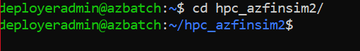

# HPC Skilling Hands-On Exercises
Zero to Batch Module

## Deployment & Use

**Introduction** 

This hands-on exercise will help demonstrate how to use the AzFinSim reference implementation for automating (terraform) deployment of containerized Azure Batch applications which scales to 10's of thousands of cores. While the application provided is a synthetic risk simulation designed to demonstrate high throughput in a financial risk/grid scenario, the actual framework is generic enough to be applied to any embarrassingly parallel / high-throughput computing style scenario. If you have a large-scale computing challenge to solve, deploying this example is a good place to start, and once running it's easy enough to insert your own code and libraries in place of AzFinSim.

**Prerequisites:** 

The following subscription requirements are needed to execute the lab steps below: 

a.   Ensure you have a existing Azure Subscription ready for use and that you log into the accounts using your AD account.

b.   Ensure the account you are using has both Contributor & User Access Administrator permissions

**Process Steps:**

 The following steps have been identified for this procedure. 

1. **Add the Role**

   Ensure the “**Microsoft Azure Batch**” application is added to the “**Contributor**” Role as follows.

   **Note:** Make sure that you don't already have this in-place by reviewing the “**Role Assignments**” tab and searching for “**Microsoft Azure Batch**”. 

   a. In Azure Portal, Open the subscription, then go to the Access Control (IAM) section, which is for the subscription you use for installation.

   

   b. On that IAM page, select "**Add role assignment**" under the Add tab.

   

   c. In the Role tab, select the **"Contributor"** role.

   

   d. In the Members tab, click the "Select members" option. Left side, The Select members Panel will open. Select "Microsoft Azure Batch".
   **Note:** If you do not see it listed you may need to check to ensure you have the right level of permissions or that your account is a member of the directory.

   

   e. After selecting the member click "Review + assign".

   

   

   f. After Assignment success, you can see Microsoft Azure Batch in the **"Role assignments"** tab

   

2. **Deploy Virtual Machine**

   Deploy Virtual Machine using the developed “**ARM TEMPLATE**” below which enables users that ability to provision the required VM with all required settings for this lab. 

   a. Note the complete URL to `<hpc_azfinsim2/armtemplate/environment/armtemplate.json>` in the hpc_acfinsim2 GitHub repo.

   Browse to the following link: https://portal.azure.com/#create/Microsoft.Template/uri/<path to armtemplate.json>

   b. Select your login (refer to previously captured account details):

   

   c. After login, the "**Custom deployment"** page will open. Select the **Resource Group** and change the password if you need. 

   Note: Please ensure you capture these settings for future use.

   d. Then create the deployment.

   

3. **Connect VM**

   Once the virtual machine has been deployed successfully, connect to the virtual machine using ssh connectivity with the password.

   Example: `ssh deployeradmin@<ip address>`

   Note: Use the “**account**” you previously provisioned in step 2d.

   

   Here is what you should expect to see when you execute the “**ssh**” command identified above.

   

4.  **AZ login**

    Next, login with the Azure CLI. 

    Example: `az login` 

    

 a. Open the link in the browser and enter the code. 

 b. Click the next button and select the required account to login. 

c. You should see the following and select “**Continue**”.

d. After login, all available accounts will be listed. 

5.  **Set az account**

Set the az account using the following command. 

Example: az account set -s \<sid\> 

**Note:** This step is not needed if you only have a single subscription as shown above.

6.  **Clone the repo**

    Clone the following repo into the connected VM.

    Example: git clone <<git repo URL>

    

7.  **Give the Permission**

    Example: sudo chmod 777 \*

    ls -ltr

    

8.  **Move to Repo**

    Example: cd hpc_azfinsim2/

    

9.  **Install requirements python package **

    To install the requirements python package, do the following command.

    Example: pip install -r src/requirements.txt

    

10. **Move to bin**

    Example: cd bin/

    

11. **(Optional) Give the Permission only if the user does not have permissions.**

    Example: sudo chmod +rx \*

    ls -ltr

    

12. **Deploy Function**

    a. To deploy, move to the bin folder and run the following command:

    Example: ./deploy.sh

    

    b. While the deployment is  running, that will ask for approval. Enter yes to accept.

    

    

13. **Inject function**

    After the deployment is complete, run the inject script.

    Example: ./inject.sh

    

14. **Build function**

    After inject script is complete, run build script.

    Example: ./build.sh

    

    

15. **Submit function**

    a. After the build script is completed successfully, run submit function.

    Example: ./submit.sh

    **Note:** If you get a permission error, move back to the root folder and run the following command.

    Example: `cd ..`

    `sudo chmod 777 src/\*`

    `ls -ltr src`

    

    b. After that, move to the bin folder and run the submit script.

    Example: ./submit.sh

    

    Output:

    

    c. After the submit script is completed. You can see the jobs and pool in your deployed environment batch account.

>> 

>> 

Another option is to leverage the Batch Explorer to view the batch task that are running.

**Viewing Running Jobs (Optional)**

Login into the "Batch Explorer" (download from https://azure.github.io/BatchExplorer/). If you click on the \"Jobs\" menu in the Batch Explorer UI, you\'ll see the three running jobs there:

16. **Clean up:** **Destroy function.**

    If you want to clean up the environment, you can run the destroy script to complete this as a final step.

    a. To delete your files, run destroy script.

    Example: ./destroy.sh

    

    b. While the destroy script is running, that will ask for approval. Enter yes to accept.
    
    

Output: All the resources are deleted in the resource group.

***Optional: Schedule cleanup***

To avoid risk of not destroying the files on time, which will result in additional usage costs, you can configure the Destroy script to be run automatically after specific number of days, such as, for example, run the destroy script automatically after 7 days. This can be accomplished using Azure Automation. Refer [this article](https://docs.microsoft.com/en-us/azure/event-grid/ensure-tags-exists-on-new-virtual-machines) for an example scenario.

## Best Practices: Securing Azure Batch 

The following are a compilation of **best practices** for securing deployments of Azure Batch:

-   Make use of User Subscription mode

-   Only expose deployed services (e.g., Azure Batch, Azure storage services, Azure Key Vault, ACR, ...) as private endpoints

-   Compute pools should

    -   Only exist in private IP address space

    -   Be deployed as a Managed Identity for ACR interaction

    -   Be separate for development and production resources

    -   Provide external access via a VPN or the Azure Bastion Service -- note that 'jump boxes' can be preinstalled with software for Windows or Linux

-   Implement a firewall

For more details on each of these items, refer to <https://github.com/mocelj/AzureBatch-Secured>.
