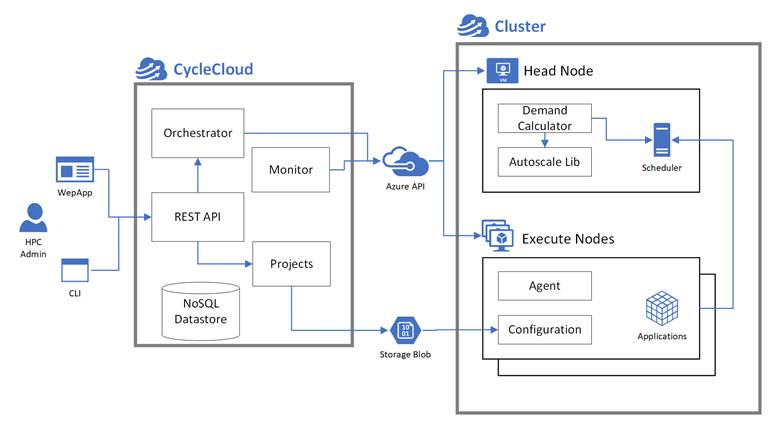

# HPC Skilling Hands-On Lab

Large Scale Deep Learning Hands On Lab for NDv4 VM Series

# Intended Use

 These hands-on exercises are intended to *follow* the presentation on large-scale Deep Learning.

 Refer to the presentation for:

·    Knowledge, skills and objectives

·    An introduction to the NDv4 VM on Azure

 # Prerequisites

This lab will leverage Codespaces to perform the module. To learn more about Codespaces, go to [GitHub Codespaces Documentation - GitHub Docs](https://docs.github.com/en/codespaces).

**Note:** If you cannot use Codespaces, you can use WSL2 with the following tools installed: [Azure CLI](https://docs.microsoft.com/en-us/cli/azure/install-azure-cli), [Bicep Tools](https://docs.microsoft.com/en-us/azure/azure-resource-manager/bicep/install)

## Running the Labs in Github Codespace

- Go to the GitHub repository for this Lab: [HPC-Accelerator](https://github.com/Azure/HPC-Accelerator)
- Click the `Code` button on this repo
  - Select `Codespaces` tab


- Click `Create codespace`
- Choose the `2 core` option


- If you don't see `Codespaces` tab, you will need to first [link your Microsoft alias to your GitHub account](https://docs.opensource.microsoft.com/github/accounts/linking/)


- Install azure cli `curl -sL https://aka.ms/InstallAzureCLIDeb | sudo bash`
- Log in to Azure from a bash or zsh terminal via: `az login --use-device-code`
- Add require additional extension `az extension add --name ssh`
- Accept the terms for CycleCloud Marketplace image `az vm image terms accept --urn azurecyclecloud:azure-cyclecloud:cyclecloud8:latest`
- Proceed to overview

> **Note: if you don't have codespaces then use Cloud Shell and clone the repo:**
> 1. Open Cloud Shell in the portal
> 1. type `git clone https://github.com/Azure/HPC-Accelerator`
> 1. cd `HPC-Accelerator`
> 1. Then follow steps from accept image terms (just before Overview)

# Overview

 These hands-on exercises emphasize the development of **skills** in support of the large-scale Deep Learning module. Once complete, a clearer understanding of this scenario is a reasonable outcome, as is the use of GPUs for Deep Learning on Azure.

 After becoming familiar with the NDv4 VM on Azure, the exercises here place emphasis on tuning in a distributed-computing setting. Specifically, use is made here of Azure CycleCloud (see architectural schematic below) to create a Slurm cluster for distributed processing on interconnected NDv4 VMs.



 Advisory: The NDv4 is a relatively new and extremely powerful offering on Azure. Consequently, it can be a challenge to secure one or more of these VMs for the purpose of working through these exercises. Although there will definitely be some differences and limitations, the NDv2 VMs may serve as a reasonable substitute – e.g., in gaining basic familiarity with isolated to interconnected NVIDIA GPUs on Azure.

 **Procedures**

 The following steps have been identified for this procedure.

 Azure CycleCloud installation will use an User Managed Identity with Contributor access.

1. Deploy the environment solution to a location `westeurope, southcentralus, eastus, eastus2, westus2` and with bicep:
```
region=southcentralus
```
```
cd scenarios/deeplearning/code/bicep/
az deployment sub create -l $region --template-file deploy.bicep
```

**Note**.You need to specify:
- prefix
- adminPassword (only use exclaimation mark `!` as spacial chars)


2. After the deployment has been completed you need to login to the CycleCloud VM using Azure Bastion throught ssh.

Note: Please replace jcodespace and ccadmin with you own used on the bicep deployment.

```
PREFIX=cs01
myuser=ccadmin
```
```
VMID=$(az vm show --resource-group $PREFIX-rg --name $PREFIX-vm-cc --query id -o tsv)
az network bastion ssh --name $PREFIX-bastion --resource-group $PREFIX-rg --auth-type password --target-resource-id $VMID --username $myuser
```

3. Once in the cyclecloud server you need to execute a script that will create a slurm custom cluster template with Nvidia NGC containers:

Note: Please replace S3tu9P@ssw0rd with you own credentials use on the bicep deployment. Use same `myuser` parameter in step 2 and 3. Use same `region` parameter as used in step 1 and 3

```
myuser=ccadmin
mypass=S3tu9P@ssw0rd
PREFIX=cs01
region=southcentralus
```
```
wget https://raw.githubusercontent.com/Azure/HPC-Accelerator/main/scenarios/deeplearning/code/script/createclustertemp.sh
chmod u+x createclustertemp.sh ; ./createclustertemp.sh $myuser $mypass $PREFIX $region
```


Make sure you have completed the project upload succesfully and have a message like the one on the picture above.

4. Start the Slurm Cluster deeplearning:

  - a.Go to the azure portal and locate the Windows Jumpbox. The VM name will have the following name "prefix"-vm-jb.

  - b.Next Connect to the VM using the Bastion mode. Using the username and passoword you already gave on the deployment process.

  - c.Using Bastion RDP session open the browser on the remote VM and put the of the "CycleCloud UI IP" that came up in the terminal.

  - d.Log in to Azure CycleCloud using the same credentials on the web GUI.


  - e.Then click "start" on the cluster.


### Note. If you don't have access to ND A100 v4 Series (Standard_ND96amsr_A100_v4 or Standard_ND96asr_A100_v4) you would only be able to do succesfully up to step 5. If you have access to NDv2 please jump to step 7.

5. Configure sshkey, login to Slurm cluster scheduler and run a test job.

  - a.Go back to the ssh terminal and run the following:

Note. My below my username is ccadmin, if you used another username please update commands appropriately.

```
scheduler=$(cyclecloud show_cluster deeplearning |grep -i scheduler|awk '//{print $4}')
sudo ssh -q -o "StrictHostKeyChecking no" -i /opt/cycle_server/.ssh/cyclecloud.pem cyclecloud@$scheduler "sudo cp /shared/home/ccadmin/.ssh/id_rsa ccadminkey; sudo chown cyclecloud ccadminkey"
sudo scp -q -o "StrictHostKeyChecking no" -i /opt/cycle_server/.ssh/cyclecloud.pem cyclecloud@$scheduler:ccadminkey .ssh/id_rsa
sudo chown ccadmin .ssh/id_rsa
ls -l .ssh/id_rsa
```


  - b.Now ssh to the scheduler node.

 ```
scheduler=$(cyclecloud show_cluster deeplearning |grep -i scheduler|awk '//{print $4}')
ssh -q -o "StrictHostKeyChecking no" $scheduler
 ```

```
wget https://raw.githubusercontent.com/Azure/HPC-Accelerator/main/scenarios/deeplearning/code/script/simpleslurmjob.sh
sbatch simpleslurmjob.sh
```


6. Run a nccl check.

  - a.Run the following to submit a test slurm job to the HPC partition but before you bring at least 2 nodes online.

```
sudo /opt/cycle/slurm/resume_program.sh deeplearning-hpc-pg0-[1-2] &
```
wget https://raw.githubusercontent.com/Azure/azurehpc/master/experimental/run_nccl_tests_ndv4/run_nccl_tests_slurm_enroot.slrm

- b.Run a script for testing nccl. Then execute the job via Slurm as follows:

```
wget https://raw.githubusercontent.com/Azure/azurehpc/master/experimental/run_nccl_tests_ndv4/run_nccl_tests_slurm_enroot.slrm

chmod +x run_nccl_tests_slurm_enroot.slrm

sbatch -N 2 -p hpc ./run_nccl_tests_slurm_enroot.slrm

```

 By running a NCCL allreduce and/or alltoall benchmark (as above), at the scale you plan on running your deep learning training job, you have arrived at a great way to identify problems with the InfiniBand inter-node network or with NCCL performance.

 For additional details, consult the performance considerations blog post [here](https://techcommunity.microsoft.com/t5/azure-global/performance-considerations-for-large-scale-deep-learning/ba-p/2693834).**
For futher detatils on Production deployment please review blog post [here](
https://techcommunity.microsoft.com/t5/azure-global/e2e-deployment-of-a-production-ready-ndv4-a100-cluster-targeting/ba-p/3580003)

7.  Run a nccl test check for NDv2 series.

  - a.Click on the Tab for Array, then select the hpc name for the nodearray, then click the edit so you can edit the current configuration for that node array.


  - b.Replace the '$HPCMachineType' with 'Standard_ND40rs_v2' , then go to the bottom of that window and expand the section *Other Settings*.

  

  - c. In that window go to the bottom and delete the *ClusterInitSpecs* text box. Paste below settings:
  ```
  =['slurm:default'=[Order=1000;Name="cyclecloud/slurm:default:2.6.4";Spec="default";Project="slurm";Version="2.6.4";SourceLocker="cyclecloud";Optional=true];'slurm_pyxis_enroot:default:1.0.0'=[Order=10010;Name="slurm_pyxis_enroot:default:1.0.0";Spec="default";Project="slurm_pyxis_enroot";Version="1.0.0";Locker="azure-storage";AdditionalSpec=true];'misc_ndv4:default:1.0.0'=[Order=10000;Name="misc_ndv4:default:1.0.0";Spec="default";Project="misc_ndv4";Version="1.0.0";Locker="azure-storage";AdditionalSpec=true];'slurm:execute'=[Order=1003;Name="cyclecloud/slurm:execute:2.6.4";Spec="execute";Project="slurm";Version="2.6.4";SourceLocker="cyclecloud"]]
  ```
  Take a look at the picture below to make the changes. After that click save.


  - d. Go back to the linux shell on the scheduler and execute the cmd below.
```
sudo /opt/cycle/slurm/cyclecloud_slurm.sh scale
```

  **You should see a message like the picture below.**


  - e. Now you are ready to run nccl test. Run the cmds bellow to download the job script and submit the slurm pyxis job.

```
wget https://raw.githubusercontent.com/Azure/HPC-Accelerator/main/scenarios/deeplearning/code/nccl%20test%20ND40rs_v2/run_nccl_tests_slurm_enroot.slrm

chmod +x run_nccl_tests_slurm_enroot.slrm

sbatch -N 1 -p hpc ./run_nccl_tests_slurm_enroot.slrm

```

**Cleanup**

If you want to clean up the environment, you can delete resource group on the portal. If you want to retain the cycle cloud deployment for future use then terminate the cluster at the Cycle Cloud UI.

