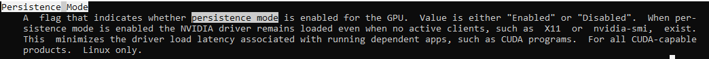

# HPC Skilling Hands-On Exercises

Large Scale Deep Learning Module: Part 1

# Intended Use

These hands-on exercises are intended to *follow* the presentation on large-scale Deep Learning.

Refer to the presentation for:

- Knowledge, skills, and experiential objectives

- Prerequisites

- An introduction to the NDv4 VM on Azure

# Overview

These hands-on exercises emphasize the development of **skills** in support of the large-scale Deep Learning module. Once complete, a clearer understanding of this scenario is a reasonable outcome, as is the use of GPUs for Deep Learning on Azure.

After becoming familiar with the NDv4 VM on Azure, the exercises here place emphasis on tuning and health checks.

Advisory: The NDv4 is a relatively new and extremely powerful offering on Azure. Consequently, it can be a challenge to secure one or more of these VMs for the purpose of working through these exercises. Although there will definitely be some differences and limitations, the NDv2 VMs may serve as a reasonable substitute -- e.g., in gaining basic familiarity with isolated to interconnected NVIDIA GPUs on Azure.

# Gaining Familiarity with NDv4 VMs on Azure

NDv4 VMs, and the solution stack that supports them, are sophisticated. Thus, the purpose of the exercises here is to gain some familiarity with this configuration.

NVIDIA GPUs require the CUDA driver and toolkit to permit use for computational purposes. Interconnected NDv4 VMs require additional drivers -- e.g., to support the InfiniBand interconnect. Although it is possible to craft software images, the *pre-built images* available from Microsoft make for an ideal starting point.

## Deployment

1. Locate a suitable image from the Azure Marketplace.

Example: Select the Ubuntu-based image as shown below:

{width="6.5in"
height="3.495138888888889in"}

Note: To gain additional insight on image options, refer to the article [here](https://techcommunity.microsoft.com/t5/azure-global/performance-considerations-for-large-scale-deep-learning/ba-p/2693834).

2. Create a VM based on the selected image.

Example: In addition to selecting the correct image, note the selection of an appropriate region for NDv4.

{width="6.5in"
height="7.670139982502187in"}

Notes

- NDv4 is a premium VM. It is likely you will require a quota increase to make use of even one of these VMs.

- As a premium VM, use of NDv4 needs to be carefully cost managed.

3. Connect to the deployed NDv4 VM.

Example: The completed deployment should appear along the same lines as the following:

{width="6.5in"
height="2.970833333333333in"}

The VM itself will appear similar to the following:

{width="6.5in"
height="3.3944444444444444in"}

Using ssh, connect to the deployed VM. Note that the IP address of the VM can be copied. Use the login and password you entered into the VM creation template.

4. Examine the NDv4 VM.

In creating the NDv4 VM, use was made of the a custom software image. List the contents of the /opt directory to get a sense as to the pre-installed software -- e.g., various toolchains, MPI implementations, etc.

{width="6.5in"
height="1.8104166666666666in"}

5. Ensure the GPUs are computationally available.

The NVIDIA CUDA driver and toolkit are included in this custom software image.

To ensure GPUs are available for use, employ the NVIDIA System Management Interface (SMI) as follows:

{width="6.047424540682415in"
height="7.669762685914261in"}

Notes:

- The NDv4's eight GPU are each identifiable

- nvidia-smi is a priviledged-access command -- you must execute as root

Best practice: If use of nvidia-smi fails to yield the expected response (as above), there is likely an issue with the loading of the CUDA driver. In other words, nvidia-smi serves as an excellent 'sanity check' of correct operations.

**Optional: Cleanup**

If you want to clean up the environment, you can run the destroy script to complete this as a final step.

To delete your files, run destroy script. While the destroy script is running, that will ask for approval. Enter yes to accept.

Output: All the resources are deleted in the resource group.

<u>***Schedule cleanup***</u>

To avoid risk of not destroying the files on time, which will result in additional usage costs, you can configure the Destroy script to be run automatically after specific number of days, such as, for example, run the destroy script automatically after 7 days. This can be accomplished using Azure Automation. Refer [this article](https://docs.microsoft.com/en-us/azure/event-grid/ensure-tags-exists-on-new-virtual-machines) for an example scenario.

## Tuning

The clock rates of GPUs can be set dynamically. As maximizing performance is often the objective, it is desirable to set GPU clock
rates to their maximum values.

6. To maximize clock rates, for all GPUs in a VM, execute the `max_gpu_app_clocks.sh` Bash script as follows:

{width="6.5in"
height="4.242361111111111in"}

7. To reset or list the clock-rate values, make use of the -r or -l options to max_gpu_app_clocks.sh, respectively. To illustrate:

{width="6.5in"
height="2.6395833333333334in"}

Notes

- Tuning has been illustrated on an isolated VM. Such commands can be executed via a workload manager (WLM). This is particularly useful in ensuring, for example, that GPU clock rates are maximized just prior to execution of a computationally intensive workload.

- Dynamically set clock rates will not persist unless enabled (via "Persistence Mode"). See below for the entry on this mode from main page.

Best practice: It is a good idea to reset clock rates to their default values after use is made. More than merely a courtesy to other users, lower the clock rate conserves power consumption.

{width="7.358954505686789in"
height="0.6203226159230096in"}

The max_gpu_app_clocks.sh Bash script is available from the GitHub repo at
<https://github.com/Azure/azurehpc/tree/master/experimental/gpu_optimizations>.

## Pinning

Non-Uniform Memory Access (NUMA) architecture configurations deliver the abstraction of contiguous shared memory. In reality, however, there exists locality between different components -- e.g., classically CPUs and adjacent memory.

From the architecture of the NDv4 configuration, it is evident that locality exists between GPUs and CPUs -- the figure below from
<https://techcommunity.microsoft.com/t5/azure-global/performance-considerations-for-large-scale-deep-learning/ba-p/2693834>
illustrates.

{width="6.5in" height="3.65625in"}

8. Determine the topology of an NDv4 VM.

An option of nvidia-smi provides the topology details as in the following example:

{width="6.5in"
height="2.5256944444444445in"}

A useful pinning tool is available from the GitHub repo at
<https://github.com/Azure/azurehpc/tree/master/experimental/check_app_pinning_tool>.
It also provides the details on the locality of CPU cores and GPUs:

{width="5.6570395888014in"
height="7.209339457567804in"}

Informed with topology awareness, pinning specifics can be provided to most WLMs (see below for an example). Pinning is crucial to ensuring optimal and consistent performance.

{width="6.5in"
height="3.828472222222222in"}

# Health Checks

Various possibilities exist for health checks. A simple, yet important, example involves host-to-device and device-to-host transfer bandwidths.
Using a test from the CUDA toolkit (<https://docs.nvidia.com/cuda/demo-suite/index.html#bandwidthTest>), it is possible to ensure appropriate transfer rates. For example:

{width="6.5in"
height="2.0541666666666667in"}
