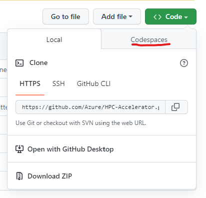
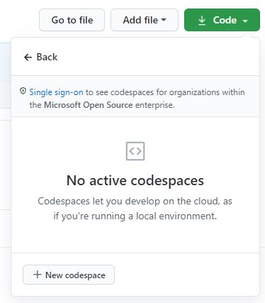
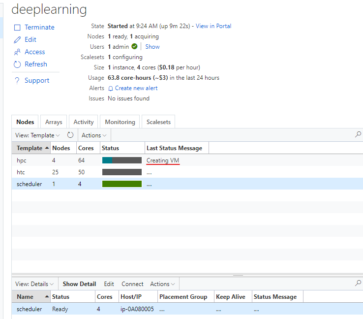
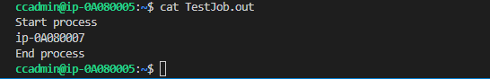

# HPC Skilling Hands-On Exercises

Large Scale Deep Learning Module: Part 2

# Intended Use

 These hands-on exercises are intended to *follow* the presentation on large-scale Deep Learning.

 Refer to the presentation for:

·    Knowledge, skills and objectives

·    An introduction to the NDv4 VM on Azure

 The exercises here comprise the second part of this module; you are expected to have completed the Part 1 exercise first.

 # Prerequisites

This lab will leverage Codespaces to perform the module. To learn more about Codespaces, go to [GitHub Codespaces Documentation - GitHub Docs](https://docs.github.com/en/codespaces).

**Note:** If you cannot use Codespaces, you can use WSL2 with the following tools installed: [Azure CLI](https://docs.microsoft.com/en-us/cli/azure/install-azure-cli), [Bicep Tools](https://docs.microsoft.com/en-us/azure/azure-resource-manager/bicep/install)

## Running the Labs in Github Codespace

- Go to the GitHub repository for this Lab: [HPC-Accelerator](https://github.com/Azure/HPC-Accelerator)
- Click the `Code` button on this repo
  - Select `Codespaces` tab

  
  - If you don't see `Codespaces` tab, you will need to first [link your Microsoft alias to your GitHub account](https://docs.opensource.microsoft.com/github/accounts/linking/) 


- Click `New codespace`
- Choose the `2 core` option
- Install azure cli `curl -sL https://aka.ms/InstallAzureCLIDeb | sudo bash` 
- Log in to Azure from a bash or zsh terminal via: `az login --use-device-code`
- Add require additional extension `az extension add --name ssh`
- Accept the terms for CycleCloud Marketplace image `az vm image terms accept --urn azurecyclecloud:azure-cyclecloud:cyclecloud8:latest`
- Proceed to overview 

# Overview

 These hands-on exercises emphasize the development of **skills** in support of the large-scale Deep Learning module. Once complete, a clearer understanding of this scenario is a reasonable outcome, as is the use of GPUs for Deep Learning on Azure.

 After becoming familiar with the NDv4 VM on Azure, the exercises here place emphasis on tuning in a distributed-computing setting. Specifically, use is made here of Azure CycleCloud (see architectural schematic below) to create a Slurm cluster for distributed processing on interconnected NDv4 VMs.


 Advisory: The NDv4 is a relatively new and extremely powerful offering on Azure. Consequently, it can be a challenge to secure one or more of these VMs for the purpose of working through these exercises. Although there will definitely be some differences and limitations, the NDv2 VMs may serve as a reasonable substitute – e.g., in gaining basic familiarity with isolated to interconnected NVIDIA GPUs on Azure.

 **Procedures**

 The following steps have been identified for this procedure.

 Azure CycleCloud installation will use an User Managed Identity with Contributor access.

1. Deploy the environment solution to a location `region=northeurope` and with bicep:
```
region=
cd scenarios/deeplearning/code/bicep/
az deployment sub create -l $region --template-file deploy.bicep
```

You need to specify: 
- prefix
- virtualMachineSize (Standard_B2ms)
- adminUsername
- adminPassword


2. After the deployment has been completed you need to login to the CycleCloud VM using Azure Bastion throught ssh.

Note: Please replace ccadmin with you own used on the bicep deployment.

```
PREFIX=jcodespace
myuser=ccadmin
VMID=$(az vm show --resource-group $PREFIX-rg --name $PREFIX-vm --query id -o tsv)
az network bastion ssh --name $PREFIX-bastion --resource-group $PREFIX-rg --auth-type password --target-resource-id $VMID --username $myuser
```
3. Once in the cyclecloud server you need to execute a script that will create a slurm custom cluster template with Nvidia NGC containers:

Note: Please replace ccadmin and mypassword with you own credentials use on the bicep deployment.

```
myuser=ccadmin
mypass=S3tu9P@ssw0rd
wget https://raw.githubusercontent.com/Azure/HPC-Accelerator/main/scenarios/deeplearning/code/script/createclustertemp.sh
chmod u+x createclustertemp.sh ; ./createclustertemp.sh $myuser $mypass
```


Make sure you have completed the project upload succesfully and have a message like the one on the picture above.

4. Create a Slurm Cluster using the custom template "slurm-ngc":

- a.   Go to the azure portal and locate the CycleCloud server DNS name. Copy and pasted on the web browser.

- b.   Log in to Azure CycleCloud via the web-based GUI.


- c.   Click on the "slurm-ngc" icon.


- d.   Next entered the name you want for the cluster.


- e.   Click on the “Required Settings” horizontal tab. 

Note.Change the Scheduler VM Type and HPC VM Type if the VM selected are not available for you.


- f.   Click on the “Advanced Settings” horizontal tab. Under the software section, click the check box for "Custom image" for each OS Nodes(Scheduler, HPC, HTC) change the custom image to `microsoft-dsvm:ubuntu-hpc:1804:latest`. Then go to the Advanced Networking section and uncheck "Return Proxy" and "Public Head Node". Below is a reference picture.


- f.   Then click the “Save” at the botton right corner and click "start" on the cluster.


5. Configure sshkey, login to Slurm cluster scheduler and run a test job.

- a.   Go back to the ssh terminal and run the following:

Note. My below my username is ccadmin, if you used another username please update commands appropriately.

```
scheduler=$(cyclecloud show_cluster deeplearning |grep -i scheduler|awk '//{print $4}')
sudo ssh -q -o "StrictHostKeyChecking no" -i /opt/cycle_server/.ssh/cyclecloud.pem cyclecloud@$scheduler "sudo cp /shared/home/ccadmin/.ssh/id_rsa ccadminkey; sudo chown cyclecloud ccadminkey"
sudo scp -q -o "StrictHostKeyChecking no" -i /opt/cycle_server/.ssh/cyclecloud.pem cyclecloud@$scheduler:ccadminkey .ssh/id_rsa
sudo chown ccadmin .ssh/id_rsa
ls -l .ssh/id_rsa
```


- b.   Now ssh to the scheduler node.

 ```
scheduler=$(cyclecloud show_cluster deeplearning |grep -i scheduler|awk '//{print $4}')
ssh -q -o "StrictHostKeyChecking no" $scheduler
 ```

- c.   Run the following to submit a test slurm job to the HPC partition.

```
wget https://raw.githubusercontent.com/Azure/HPC-Accelerator/javier02/scenarios/deeplearning/code/script/simpleslurmjob.sh
sbatch simpleslurmjob.sh
```





6.   Run a health check.

a.   Ssh into the scheduler node. Copy the script below into a file called “nccl.slrm”. Then execute the job via Slurm as follows:

```bash
m.  sbatch -N 4 ./nccl.slrm
```

 **#!/bin/bash**

\#SBATCH -t 00:20:00

\#SBATCH --ntasks-per-node=8

\#SBATCH --gpus-per-node=8

\#SBATCH -o logs/%x_%j.log

export UCX_IB_PCI_RELAXED_ORDERING=on \

​    UCX_TLS=tcp \

​    NCCL_DEBUG=INFO \

​    CUDA_DEVICE_ORDER=PCI_BUS_ID \

​    NCCL_IB_PCI_RELAXED_ORDERING=1 \

​    NCCL_SOCKET_IFNAME=eth0 \

​    UCX_NET_DEVICES=eth0 \

​    NCCL_TOPO_FILE=/workspace/nccl/nccl-topology.txt

CONT="nvcr.io#nvidia/pytorch:21.05-py3"

MOUNT="/nfs2/nccl:/workspace/nccl_284,/nfs2/hpcx-v2.8.1-gcc-MLNX_OFED_LINUX-5.1-0.6.6.0-ubuntu18.04-x86_64:/opt/hpcx,/nfs2/nccl_2.10.3-1/nccl:/workspace/nccl"

 export OMPI_MCA_pml=ucx

export OMPI_MCA_btl=^openib

export OMPI_MCA_COLL_HCOLL_ENABLE=0

srun --ntasks=$SLURM_JOB_NUM_NODES --container-image "${CONT}" \

  --container-name=nccl \

  --container-mounts="${MOUNT}" \

  --ntasks-per-node=1 \

  bash -c "apt update && apt-get install -y infiniband-diags"

 srun --gpus-per-node=8 \

  --ntasks-per-node=8 \

  --container-name=nccl \

  --container-mounts "${MOUNT}" \

  bash -c 'export LD_LIBRARY_PATH=/opt/hpcx/nccl_rdma_sharp_plugin/lib:/opt/hpcx/sharp/lib:/workspace/nccl/build/lib:$LD_LIBRARY_PATH && /workspace/nccl/nccl-tests/build/alltoall_perf -b8 -f2 -g1 -e 8G'

 By running a NCCL allreduce and/or alltoall benchmark (as above), at the scale you plan on running your deep learning training job, you have arrived at a great way to identify problems with the InfiniBand inter-node network or with NCCL performance.

 For additional details, consult the performance considerations blog post [here](https://techcommunity.microsoft.com/t5/azure-global/performance-considerations-for-large-scale-deep-learning/ba-p/2693834).**

**Optional: Cleanup**

If you want to clean up the environment, you can run the destroy script to complete this as a final step.

To delete your files, run destroy script. While the destroy script is running, that will ask for approval. Enter yes to accept.

Output: All the resources are deleted in the resource group.

<u>***Schedule cleanup***</u>

To avoid risk of not destroying the files on time, which will result in additional usage costs, you can configure the Destroy script to be run automatically after specific number of days, such as, for example, run the destroy script automatically after 7 days. This can be accomplished using Azure Automation. Refer [this article](https://docs.microsoft.com/en-us/azure/event-grid/ensure-tags-exists-on-new-virtual-machines) for an example scenario.
