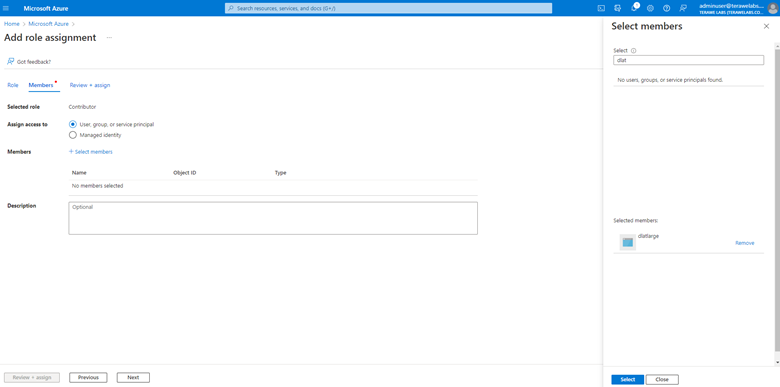
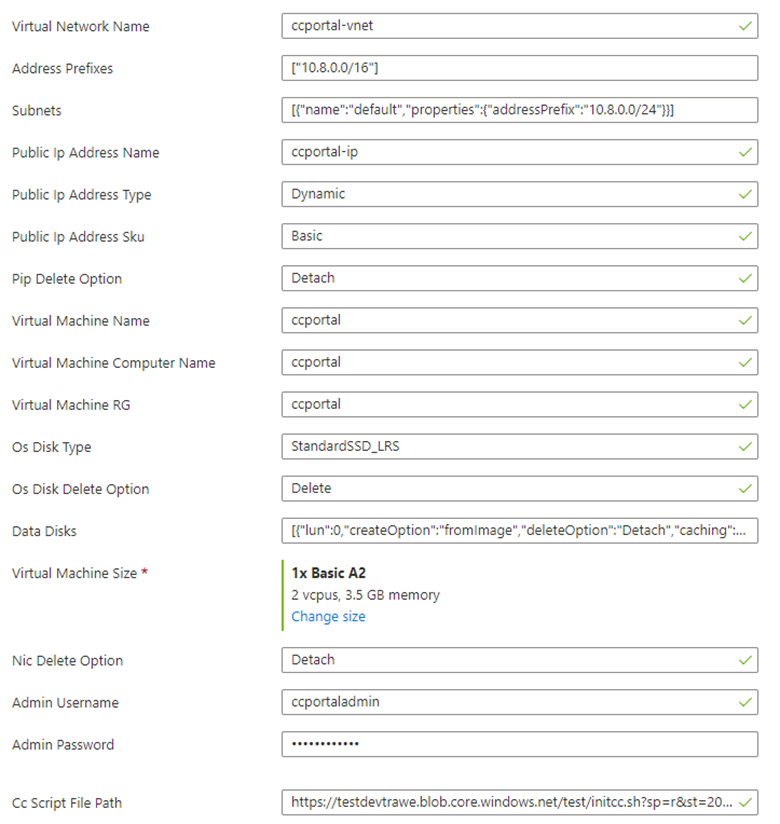

# HPC Skilling Hands-On Exercises

Large Scale Deep Learning Module: Part 2

# Intended Use

 These hands-on exercises are intended to *follow* the presentation on large-scale Deep Learning.

 Refer to the presentation for:

·    Knowledge, skills, and experiential objectives

·    Prerequisites

·    An introduction to the NDv4 VM on Azure

 The exercises here comprise the second part of this module; you are expected to have completed the Part 1 exercise first.

# Overview

 These hands-on exercises emphasize the development of **skills** in support of the large-scale Deep Learning module. Once complete, a clearer understanding of this scenario is a reasonable outcome, as is the use of GPUs for Deep Learning on Azure.

 After becoming familiar with the NDv4 VM on Azure, the exercises here place emphasis on tuning in a distributed-computing setting. Specifically, use is made here of Azure CycleCloud (see architectural schematic below) to create a Slurm cluster for distributed processing on interconnected NDv4 VMs.


 Advisory: The NDv4 is a relatively new and extremely powerful offering on Azure. Consequently, it can be a challenge to secure one or more of these VMs for the purpose of working through these exercises. Although there will definitely be some differences and limitations, the NDv2 VMs may serve as a reasonable substitute – e.g., in gaining basic familiarity with isolated to interconnected NVIDIA GPUs on Azure.

 **Procedures**

 The following steps have been identified for this procedure.

 An application ID is required for each instance of Azure CycleCloud. After registering an application for this purpose, Contributor access is assigned to the same. The detailed steps follow below.

1. Create a new application registration similar to the following:


2. After registering the application, the corresponding overview screen should appear as shown below:


From the overview screen of the newly registered application, copy the “Application (client) ID” and the “Directory (tenant) ID” to a temporary document for future use.

3. To assign “Contributor” access to this newly created application (namely “dlatlarge” in this case), follow these steps:

a.   Select the subscription that Azure CycleCloud will make use of, and select the “Access control (IAM)” entry as shown below:


b.   By selecting “Add role assignment” on the previous, you will arrive at the screen below:


 Select “Contributor” as the role to be assigned.

 c.   Next, add members to this new role assignment as follows – explicitly “dlatlarge” – as follows:





As shown below, “dlatlarge” has been targeted as a member that has “Contributor” access to this subscription:


Note that “Review + assign” is required to enact this role assignment; this is illustrated below:


d.   Verify that the application (“datlarge”) has been successfully granted “Contributor” access by locating it in the “Access control (IAM)” view of the subscription ("Microsoft Azure” in this case).


4. Return to the application registration view for the application of interest – here “dtatlarge” as shown below:


5. From this view, click on “Add a certificate or secret” in the upper-right area to arrive at the view below. Note that in the view below, a “New client secret” was added.


Copy and paste the value of the new client secret (“dtatlarge test” in this case) to temporary storage, as it will be needed shortly.

6. Create an Azure CycleCloud deployment.

 a.   Click on the ARM template [here](https://portal.azure.com/#create/Microsoft.Template/uri/https%3A%2F%2Fraw.githubusercontent.com%2Fnandakumar-terawe%2FAzureCycleCloudArmTemplate%2Fmain%2FarmTemplate.json). Note that this link will open the **custom template** illustrated below in the Azure portal:





 The purpose of this template is to ease the creation of an Azure CycleCloud deployment.

 The template is maintained via a GitHub repo [here](https://github.com/nandakumar-terawe/AzureCycleCloudArmTemplate) as follows:

 

b.   Minimally, insert into the template your values for the tenant and application IDs, as well as the application secret. (These are the three items you were encouraged to place into temporary storage – e.g., a buffer in an editor such as Notepad).

c.   Enter and make note of your password.

 A complete deployment will appear as below:


7. Finalize the deployment of Azure CycleCloud.

a.   From the completed-deployment screen, select “Outputs” from the top-left area. You will see output similar to that below:


b.   Copy the execute script to temporary storage for later use.

c.   Return to the completed-deployment view, and select the URL corresponding to the deployed VM. This is the VM onto which Azure CycleCloud has been deployed. Obtain the IP address for this VM and ssh into it (see below).

d.   The “executeScript” copied to temporary storage needs to be pasted into the shell session (on the Azure CycleCloud VM) as shown below:

 

 By executing this script, the configuration Azure CycleCloud has been completed.

8. Launch Azure CycleCloud.

a.   The IP address used to complete the configuration of Azure CycleCloud via an ssh session can also be used to access the web server running on this same VM. Point your web browser at https://<public IP address of the Azure CycleCloud node>.

b.   Log in to Azure CycleCloud via the web-based GUI.

c.   At the very bottom of the page presented, click on the gear icon.

d.   Next click on the subscription entered into the software.

e.   By clicking on edit, you can ensure that the details captured via the ARM template have been ingested into Azure CycleCloud as shown below:


f.    From the edit subscription screen, perform a sanity check by clicking on “Validate Credentials”. At this point, Azure CycleCloud has been configured for use.

9. Configure a Slurm cluster in Azure CycleCloud.

a.   From the Azure CycleCloud GUI, click on the plus sign “+” (bottom left) to add a new cluster. From this screen, click on the “Slurm” icon to add a new cluster based on this workload manager.


 b.   Enter a name for your cluster as below:


 c.   Complete the “Required Settings” horizontal tab so it appears as below:


 Note that the NDv4 VMs have been selected.

d.   There’s no need to make any changes to the “Network Attached Storage” tab.

e.   Under “Advanced Settings”, accept the defaults for Slurm and Azure settings. Under “Software”, ensure your deployment appears as below:


 f.    The default settings under the “cloud-init” tab are fine for this setup.

g.   Click on “Save” to persist your configuration.

h.   Click on the left-most horizontal tab that corresponds to your cluster.

i.    Click on the “Start” button to start your cluster. Once active, your cluster will look similar to:


j.    Click on the node entry corresponding to the scheduler as below:


 k.   Click on “Connect” in the lower panel to determine the ssh details for the Slurm scheduler as follows:


 l.    Run a health check.

a.   Ssh into the scheduler node. Copy the script below into a file called “nccl.slrm”. Then execute the job via Slurm as follows:

```
m.  sbatch -N 4 ./nccl.slrm
```

 **#!/bin/bash**

\#SBATCH -t 00:20:00

\#SBATCH --ntasks-per-node=8

\#SBATCH --gpus-per-node=8

\#SBATCH -o logs/%x_%j.log

export UCX_IB_PCI_RELAXED_ORDERING=on \

​    UCX_TLS=tcp \

​    NCCL_DEBUG=INFO \

​    CUDA_DEVICE_ORDER=PCI_BUS_ID \

​    NCCL_IB_PCI_RELAXED_ORDERING=1 \

​    NCCL_SOCKET_IFNAME=eth0 \

​    UCX_NET_DEVICES=eth0 \

​    NCCL_TOPO_FILE=/workspace/nccl/nccl-topology.txt

CONT="nvcr.io#nvidia/pytorch:21.05-py3"

MOUNT="/nfs2/nccl:/workspace/nccl_284,/nfs2/hpcx-v2.8.1-gcc-MLNX_OFED_LINUX-5.1-0.6.6.0-ubuntu18.04-x86_64:/opt/hpcx,/nfs2/nccl_2.10.3-1/nccl:/workspace/nccl"

 export OMPI_MCA_pml=ucx

export OMPI_MCA_btl=^openib

export OMPI_MCA_COLL_HCOLL_ENABLE=0

srun --ntasks=$SLURM_JOB_NUM_NODES --container-image "${CONT}" \

  --container-name=nccl \

  --container-mounts="${MOUNT}" \

  --ntasks-per-node=1 \

  bash -c "apt update && apt-get install -y infiniband-diags"

 srun --gpus-per-node=8 \

  --ntasks-per-node=8 \

  --container-name=nccl \

  --container-mounts "${MOUNT}" \

  bash -c 'export LD_LIBRARY_PATH=/opt/hpcx/nccl_rdma_sharp_plugin/lib:/opt/hpcx/sharp/lib:/workspace/nccl/build/lib:$LD_LIBRARY_PATH && /workspace/nccl/nccl-tests/build/alltoall_perf -b8 -f2 -g1 -e 8G'

 By running a NCCL allreduce and/or alltoall benchmark (as above), at the scale you plan on running your deep learning training job, you have arrived at a great way to identify problems with the InfiniBand inter-node network or with NCCL performance.

 For additional details, consult the performance considerations blog post [here](https://techcommunity.microsoft.com/t5/azure-global/performance-considerations-for-large-scale-deep-learning/ba-p/2693834).**

**Optional: Cleanup**

If you want to clean up the environment, you can run the destroy script to complete this as a final step.

To delete your files, run destroy script. While the destroy script is running, that will ask for approval. Enter yes to accept.

Output: All the resources are deleted in the resource group.

<u>***Schedule cleanup***</u>

To avoid risk of not destroying the files on time, which will result in additional usage costs, you can configure the Destroy script to be run automatically after specific number of days, such as, for example, run the destroy script automatically after 7 days. This can be accomplished using Azure Automation. Refer [this article](https://docs.microsoft.com/en-us/azure/event-grid/ensure-tags-exists-on-new-virtual-machines) for an example scenario.
