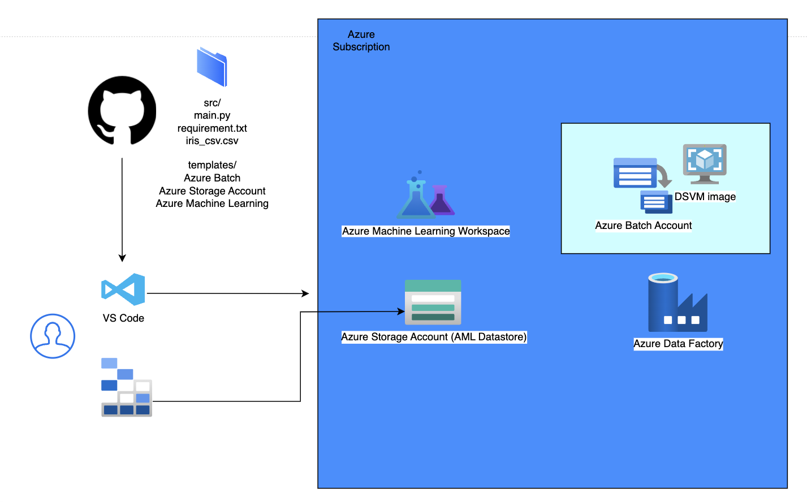

# Architecture of what will be deployed

## Use Case

This use case is modeled after a customer use case of using Azure Batch compute to train an AI model for consumption. This Azure Batch account is created with a DSVM image for the purpose of using Python easily. In the field, you can also use a start command for Azure Batch to install Python on your image. We will use Azure Data Factory to run the AI modeling on Azure Batch compute. The model will be a simple classification task on the Iris dataset. The main.py script will perform the training on the Iris dataset cited in the README. After training, the script will upload the MLFlow model to Azure storage associated with the Azure Machine Learning workspace. From there, we will register the model in the AML workspace, create a batch endpoint and deploy the model to the endpoint. Take some time and Examine the bicep code, the iris csv file and the main.py script that will be used in different stages.

Here is a [video link](https://microsoft.sharepoint.com/:v:/t/LevelUpSkilling/ESKJGpDzxipCs0OtUVt1kyYBPXZEMusnGrLE0CjLHg022w?e=9dp1tL) to follow along visually with the entire process

## Step by Step

We are going to do the following steps:

- Create our resources from Bicep code
  - Azure Batch
  - Azure Batch Pool with DSVM image
  - Azure Machine Learning workspace with supporting resources
    - Log Analytics Workspace
    - Monitor Insights
    - Container
  - Azure Storage Account (datastore) associated with the AML workspace
  - Azure Data Factory with supporting resources
- Train a model in Azure Data Factory
- Register a model with Azure Machine Learning
- Create a compute cluster in Azure Machine Learning
- Create a batch endpoint in Azure Machine Learning
- Deploy our model to our endpoint

### Deploy Base Components

We designed this lab with VSCode in mind. Use whatever IDE you like.

#### 1. Bicep Deployment

1. Open the terminal console (CTRL + ~) in VS Code (if not already open) and navigate to the `bicep` directory from the cloned repository, and type the following commands.
    >Note: Wait for each operation to complete before proceeding to the next line:

    * Log in to your tenant.
      >az login
    * Set the subscription to use.
      >az account set -s {subscriptionid}
    * Initiate the deployment process
      >az deployment sub create --template-file .\main.bicep --location {region of deployment. ex. westus3} --parameters location={region of deployment. ex. westus3}

2. After the deployment process is done, open the Azure Portal and go to your list of resource groups, you will find a newly created one with a random generated name in the region you selected.
Open a text editor in your computer to store the following information:

#### 2. Storage Account

1. Open the storage account and go to **Shared Access Signature**
2. For permissions, under **Allowed Services**, ensure all available options are selected
3. Under **resource types**, select all available options
4. Choose a **start and end date** for the validity of the SAS token
5. Select **HTTPS only**
6. Validate your selections. Anything not specified above can be left default
7. Click on **Generate SAS and Connection String** and copy the **Connection String** and the **Blob Service SAS URL** (not the SAS token!). Save this locally temporarily
8. Still on the Storage Account, go to **Containers** and look for the blob that contains `blobstore` on its name and copy the full name in the text file you are using.

#### 3. Azure Batch Account

1. Open **Microsoft Storage Explorer** locally
    - Right click on **Storage Accounts** in the left hand pane
    - Click on **Connect to Azure Storage**
    - Select **Storage Account or Service**
    - Select **Shared Access Signature URL**, click next
    - Enter the saved **blob service URL** in the appropriate text box, the display name will populate automatically but you are free to change it. This is the display name in Storage Explorer. Click Connect
    - You should see the storage account connection pop up in the left hand pane under **Storage Accounts**.
2. Click on the storage account and expand **Blob Containers**. Click on the container with `blobstore` in the name. In the top pane, select **+New Folder** and name it `datasets`.
3. Click on **Upload** in the top pane and select **Upload Files**.
4. In the pop up window that emerges, next to the **Selected Files** box, select **...**.
5. Navigate to the cloned repository location, and drill down to the `src` folder and select the `iris_csv.csv` and `main.py` files. Leave all defaults and select **Upload** in the bottom right of the window.

### Train the model using Azure Data Factory

1. Come back to the **Azure Portal** and go to **Azure Data Factory** to **launch the ADF Studio**
    - Expand the left hand pane
    - Select **Author** and then select the **Pipelines** tab, click on the **three dots** and click on **New Pipeline**
    - Under Activities, search for **Custom** and drag the **Custom activity** to the center pane
    - In the lower properties pane for the custom task, under General, give the activity a friendly name.
2. Move to the **Azure Batch** tab
    - From the drop down in that tab, select the **Azure Batch service** associated with the Data Factory account. We already created the linked service when we deployed the Bicep template
3. Move to the **Settings** tab
    - In the **Resource Linked Service** dropdown, select the storage account linked service that was also created upon deployment
    - Next to **Folder Path** setting, click on **Browse storage**. Click on the container with `blobstore` in the name and drill down to the `datasets` folder . Click OK.
    - In the `command` text box, enter the command 
      >python main.py --iris-csv iris_csv.csv --epochs 50 --lr 0.1 --connectionString "{Azure storage account datastore connection string}" --containerName "{datastore container name}/datasets"

        Do the replacements indicated with the brackets. At this point you should have your connection string and the full name of the `blobstore` container from the steps above.
4. At the top of the ADF workspace, click on **Validate**. Then click on **Publish all**. Once the job is published, click on **Add trigger** and select **trigger now**. The job will begin to run. It may be in the queuing stage for a few minutes before running.
Wait until the job is finished.

5. In the Azure Portal, go to your **Storage Account > Containers > blobstore container > datasets**. You should see a new folder there, likely named `0`. Drill down until you get to the **model folder under artifacts**. Validate that a set of files that were produced from the Python script training on the Iris dataset.

### Register a Model with Azure Machine Learning

- Open the **Azure Machine Learning** resource and then **Launch Studio**
- On the left hand pane, click on **Models**
- Click on **+ Register**, then select **From datastore**
- Select 'MLFlow' in **model type** and click on **Browse**
- Drill down through the datastore folder, down to the **model folder**. Make sure the **model** folder is selected (you will be able to see the contents of the model folder) and click save
- Then click Next and enter the following **Name** `iris_classification` and Version `1` respectively
- Click **Next** and then **Register**

### Create a Compute cluster

- Go to the **Azure Machine Learning studio**
- Click on **Compute**
- Select **Compute clusters**
- Select **+ New**
- In **Location** select the same region as the original deployment
- Select **Dedicated** and **CPU**
- Choose a VM from the **recommended options**
- Click **Next**
- Enter a friendly **name** for the Compute cluster. Leave all other defaults
- Click **Create**

### Create a Batch Endpoint

- Go to the **Azure Machine Learning Studio**
- Go to **Endpoints**
- Select **Batch Endpoints**
- Select **Create**
- Give a friendly **name** for the endpoint. Click **Next**
- Select the **model** you registered earlier. Click **Next**
- Leave the defaults on the **Deployment page**. Click **Next**
- Since we are using an MLFlow model, we do not need to add a scoring script. Click **Next**
- Select the **cluster** that you created previously. Leave the instance count on defaults. Click **Next**
- Review the information. Click **Create**
- You should see the new endpoint on the Endpoints page after it is created

### Deploy the Model to the Endpoint

- Go to the **Azure Machine Learning Studio** and click on **Models**. You should see the model that you previously registered with the workspace
- Select the model just created and select **Deploy > Batch Endpoint**
- Select **Existing** and then select the item that show up
- Select 'iris_classification'. Click **Next**
- Review the parameters and then click **Next**
- Under **Compute Cluster** select the cluster created previously. Click **Next**
- Review the parameters and then click **Create**
- Watch that the deployment succeeded.