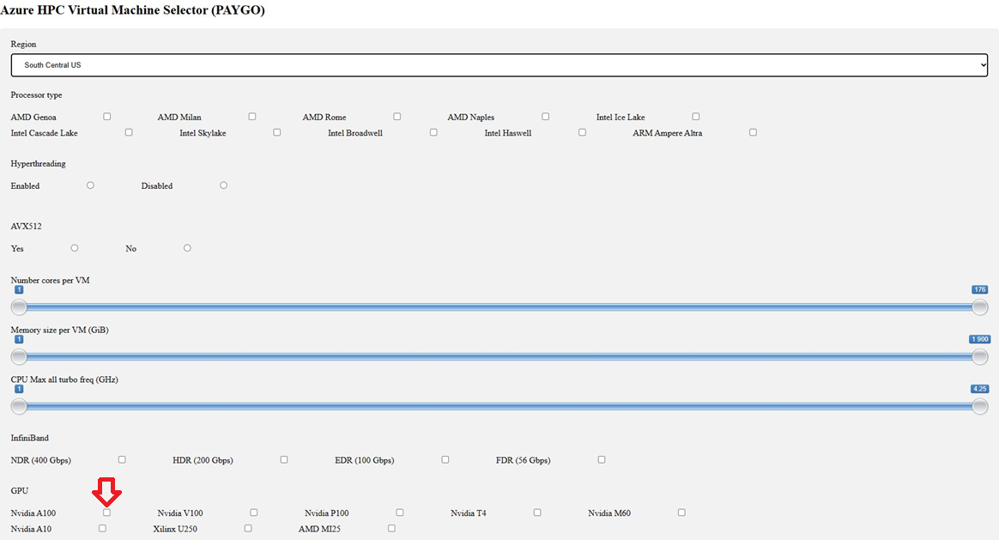

# HPC/AI VM Selector Tool

## Intended Use

The HPC VM Selector has been created to help architects and customers choose the right sku for their workload from the many Azure virtual machines available.  The tool can be installed and run locally on your workstation and or published to Azure itself.

## Overview

The HPC VM Selector tool is great when you are looking for a specific characteristic of a virtual machine that are not available in our public [Azure Virtual Machine Selector](https://azure.microsoft.com/en-us/pricing/vm-selector/) tool.

This table highlights some of the differences that the HPC VM Selector has over our public offering. It will allow you to choose specific network, GPU or processor types which may affect workload performance.

|Feature​|Microsoft Azure VM Selector (public)​|HPC VM Selector (installable)​|
|----|---|---|
|**Region Choice**​|All regions available, can select multiple​|South Central, US, West US, West US 2, East US, East US 2, Central US, West Europe, UK South, Japan East, Southeast Asia (only one at a time)​|
|**Processor Type**|AMD, Intel, Ampere Altra ARM Based|AMD Genoa, AMD Milan, AMD Rome, AMD Naples, Intel Ice Lake, Intel Cascade Lake, Intel Skylake, Intel |Broadwell, Intell Haswell, ARM Ampere Altra​|
|**Hyperthreading**|N/A​  But mentions that most VMs have hyperthreading besides H, DC and ND VM families​|Enabled/Disabled|
|**AVX512**​|N/A​|Yes/No​|
|**Number of Cores per VM**​|1-416​|1-176​|
|**Memory Size per VM (GiB)​**|0-11,400​|1-1,900​|
|**CPU Max all turbo freq**​|N/A​|1-4.25 GHz​|
|**Infiniband**​|N/A​|NDR (400 Gbps), HDR (200 Gbps), EDR (100 Gbps), FDR (56 Gbps)​|
|**GPU**​|Just asks if you need VM to be GPU enabled​|Yes/No or No Preference  Nvidia A100, Nvidia V100, Nvidia P100, Nvidia T4, Nvidia M60, NvidiaA10, Xilinx U250, AMD MI25​|

When using the HPC VM Selector it is recommended to start the search by filtering on one or two key properties that your workload will need.  For example, if your workload will be GPU based and you know which GPU is needed, you would choose to enable that option and view the resulting virtual machines.

## Azure Installation

### Prerequisites

Running the VM Selector in Azure is the easier method to get started quickly, but some prerequisites need to be met.

- An Azure account with active subscription
- The Azure account must be at least a [Cloud application administrator](https://learn.microsoft.com/en-us/azure/active-directory/roles/permissions-reference#cloud-application-administrator)
- [Azure Cloud Shell](https://learn.microsoft.com/en-us/cli/azure/install-azure-cli-windows?tabs=azure-cli) installed locally on your workstation
- Optional installation of [Visual Studio Code](https://code.visualstudio.com/Download)
- Active Github Account

### Deployment

- Open the terminal console (CTRL + ~) in VS Code (if not already open) and navigate to the `code` directory from the cloned vm_selector repository, and type the following commands.
    >Note: Wait for each operation to complete before proceeding to the next line:

  - Log in to your tenant.
      >az login
  - Set the subscription to use.
      >az account set -s {subscription id}
  - Initiate the deployment process to a new web application
      >az webapp up --runtime 'PYTHON:3.9' --sku {Choose a machine sku} --name {Choose a unique name for your webapp} --location {region of deployment. ex. westus3}

## Local Installation

### Prerequisites

If you intend to run the VM Selector tool locally on your own workstation there a few prerequisites that need to be installed first.

- Have a working [Linux system](https://learn.microsoft.com/en-us/windows/wsl/install)
- Install [Python](https://www.python.org/downloads/)
  - Flask will work with any version of Python version 3.7 and newer
- Active Internet Connection

The following requirements will be installed as part of the environment setup 
- Install [Flask >=2.0.2](https://flask.palletsprojects.com/en/2.2.x/installation/#install-flask/)
- Install [pandas >=1.1.3](https://pandas.pydata.org/getting_started.html)
- Install [openpyxl >=3.0.5](https://pypi.org/project/openpyxl/)
- Local Web Server built into Flask

### Deployment

The following steps are needed to run the VM Selector tool locally on your workstation
  - Clone the repository to your local workstation
    > git clone <https://github.com/Azure/HPC-Accelerator.git>
  - Go to the application folder
    > cd HPC-Accelerator\scenarios\vm_selector
  - Create a virtual environment for the applicatin
    > python3 -m venv .venv
  - Activate the environment
    > source .venv/bin/activate
  - Install the dependencies
    > pip3 install -r requirements.txt
  - Run the application
    > flask run
  - Browse to the application at <http://localhost:5000>

If you have any issues a [Quickstart Guide](https://learn.microsoft.com/en-us/azure/app-service/quickstart-python/) is available that has a Microsoft published generic app that you can follow to test your environment.
